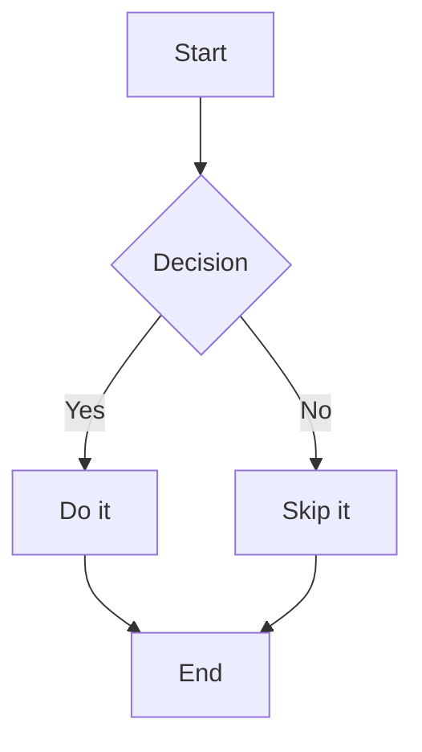
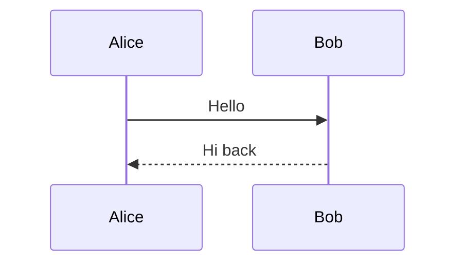

---
layout: hero
---

# Title slide

A compelling subline that sets the stage.

## Notes

This is the opening note for the hero slide.

---
layout: default
---

## Section A: Bullets and Icons

- First bullet point
- :fa-truck-fast: Bullet with a solid icon
- Another plain bullet

## Notes

Notes for section A slide.

---
layout: two-cols
---

## Two Columns Layout

::cols::

### Left column

Some left-side content.

- :fa-circle-check: Item on the left

::col2::

### Right column

Some right-side content with **bold** and _italic_ text.

::/cols::

## Notes

Notes for the two-cols slide.

---
layout: three-cols
---

## Three Columns Layout

::cols::

### Alpha

First column content.

::col2::

### Beta

Second column content.

::col3::

### Gamma

Third column content.

::/cols::

## Notes

Notes for the three-cols slide.

---
layout: statement
---

## A Bold Statement

Here is a diagram:



## Notes

This slide contains a mermaid diagram and counts as the statement layout.

---
layout: default
---

## Icon Rows Section

::boxes::

:fa-rocket: Launch your product

:fa-shield-halved: Secure by default

:fa-chart-line: Monitor and iterate

::/boxes::

## Notes

Notes for icon rows slide.

---
layout: default
---

## More Content

Paragraph with **bold**, _italic_, and `code` inline styles.

Another paragraph to ensure multi-block rendering works correctly.

---
layout: default
---

## Ordered List

1. First item
2. Second item with :fa-star: icon
3. Third item

## Notes

Ordered list notes.

---
layout: two-cols
---

## Diagram in Columns

::cols::

Left side with text content and :fa-diagram-project: icon.

::col2::



::/cols::

## Notes

Diagram inside a two-cols slide.

---
layout: default
---

## Slide Ten

Filler content to ensure we have sufficient slides for the count assertion.

---
layout: default
---

## Slide Eleven

More filler content with a :fa-info-circle: icon inline.

---
layout: default
---

## Slide Twelve

Even more content. **Bold statement** here.

---
layout: default
---

## Slide Thirteen

- Bullet one
- Bullet two
- Bullet three with :fa-arrow-right: pointing right

## Notes

Thirteen notes.

---
layout: hero
---

# Second Hero

Another hero slide with subline text.

## Notes

Hero two notes.

---
layout: default
---

## Slide Fifteen

Plain text slide.

---
layout: default
---

## Slide Sixteen

Content with code block:

```go
func main() {
    fmt.Println("hello")
}
```

---
layout: default
---

## Slide Seventeen

More slides to meet the 30+ count threshold.

---
layout: two-cols
---

## Two Cols Again

::cols::

Left content here.

::col2::

Right content here with :fa-check: checkmark.

::/cols::

---
layout: default
---

## Slide Nineteen

Paragraph content.

---
layout: default
---

## Slide Twenty

- Item A
- Item B

## Notes

Twenty notes.

---
layout: three-cols
---

## Three Cols Again

::cols::

One

::col2::

Two

::col3::

Three

::/cols::

---
layout: default
---

## Slide Twenty-Two

Content here.

---
layout: default
---

## Slide Twenty-Three

More content here.

---
layout: default
---

## Slide Twenty-Four

Yet more content.

---
layout: default
---

## Slide Twenty-Five

Almost there.

---
layout: default
---

## Slide Twenty-Six

Still going.

---
layout: default
---

## Slide Twenty-Seven

Nearly thirty.

---
layout: default
---

## Slide Twenty-Eight

Getting close.

---
layout: default
---

## Slide Twenty-Nine

One more.

---
layout: default
---

## Slide Thirty

The thirtieth slide. Done.

## Notes

Final slide notes.
